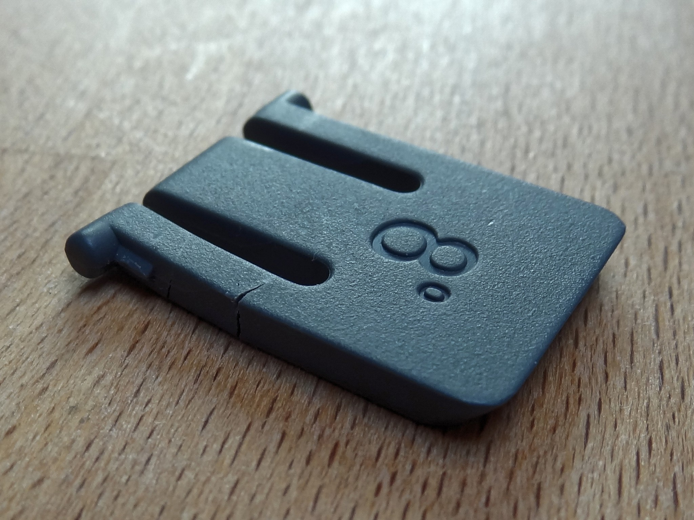
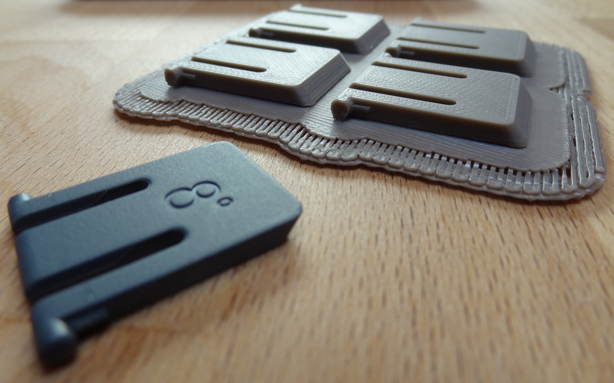
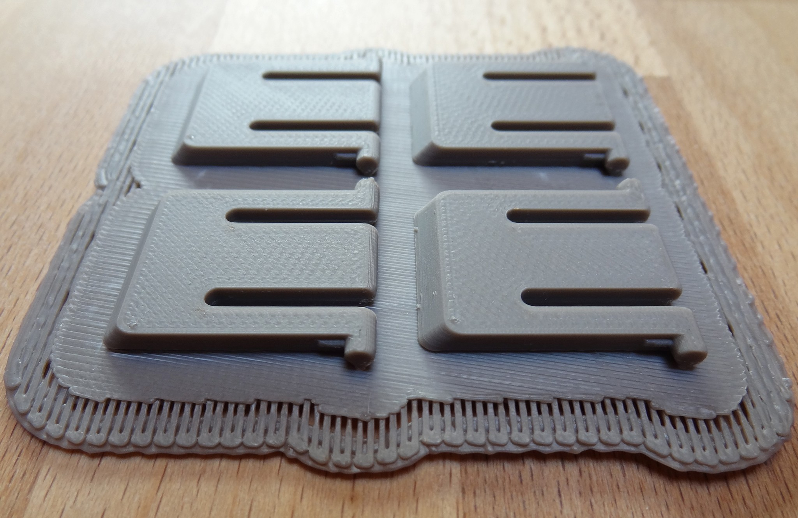
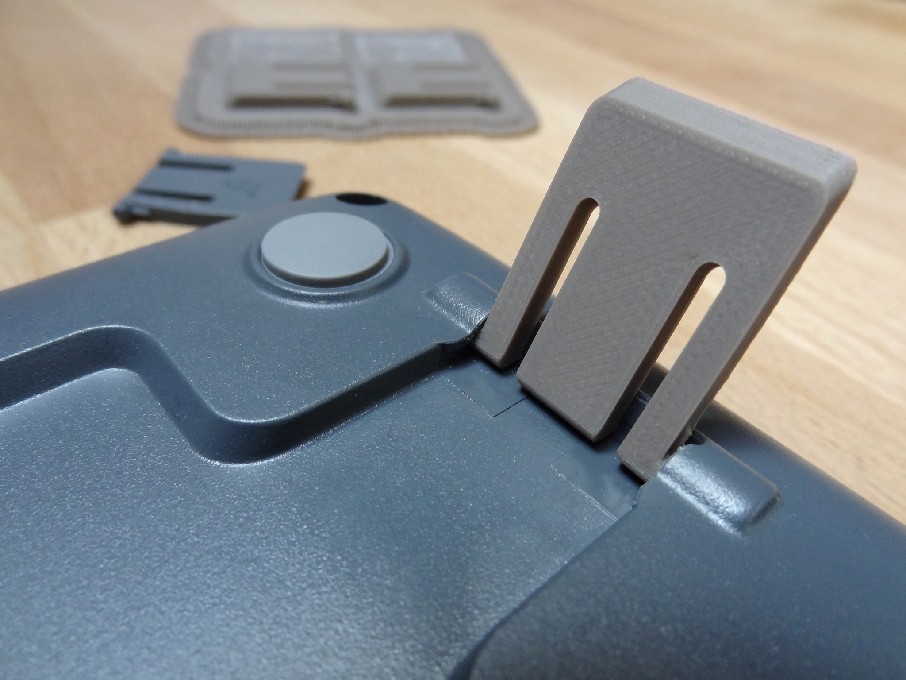
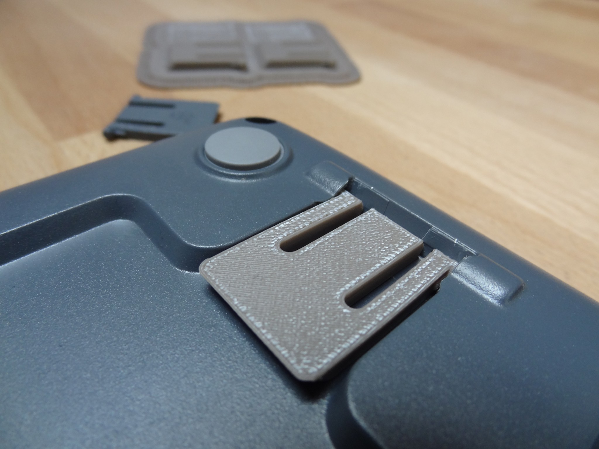
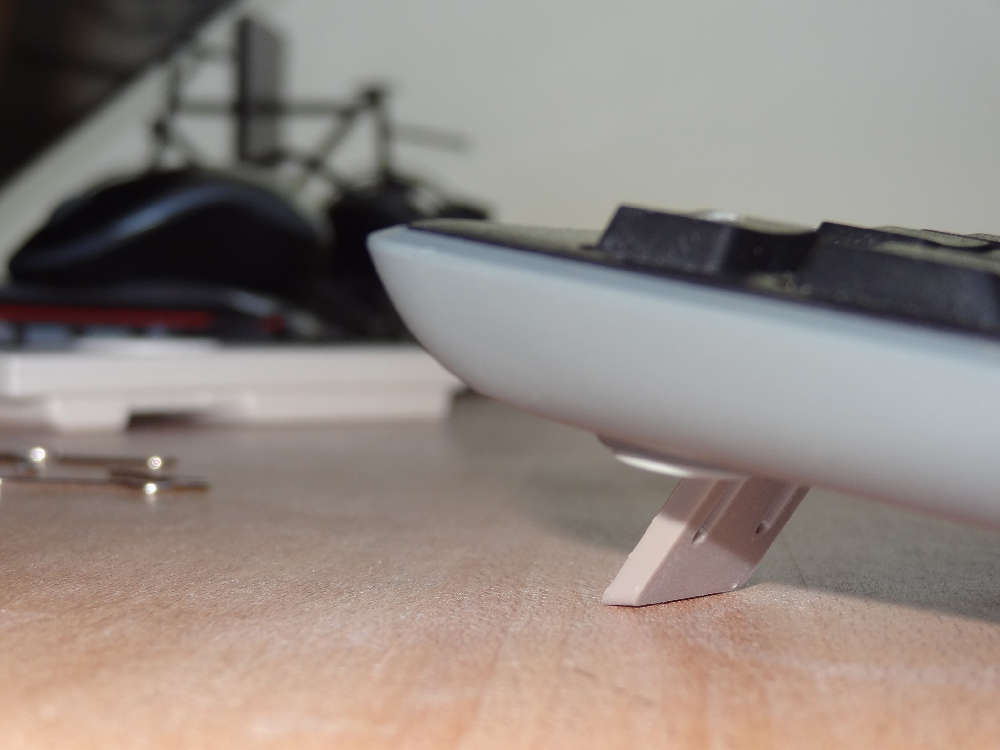

# Logitech K270 3D printed foot

## About
3D printed model ([STL](https://en.wikipedia.org/wiki/STL_(file_format)) file format) of foot replacement for [Logitech K270](https://www.logitech.fr/product/wireless-keyboard-k270) 2.4 GHz wireless keyboard.

## How-to
Print [Logitech_k270_foot.stl](Logitech_k270_foot.stl) file with your favorite 3D printer. 100% infill and finest possible resolution is recommended.

## Preview

### Original broken foot

### 3D printed new feet
Printed with a [Zortrax M200](https://zortrax.com/printers/zortrax-m200/) with [Z-SUITE](https://support.zortrax.com/downloads/) software :

## License
Logitech K270 3D printed foot is released under the [Unlicense](http://unlicense.org).